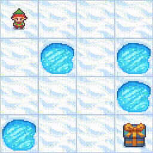
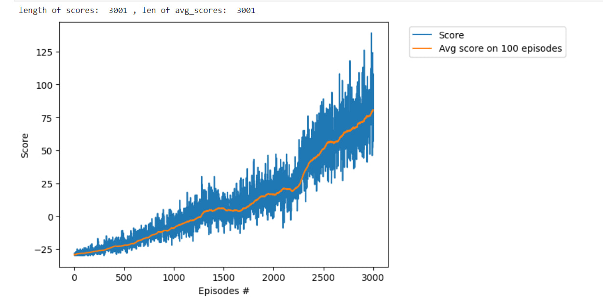

## Project 1: Solving Rubik's with Search Algorithm
- Used uninformed and informed search algorithm to solve 2*2 rubik's cube.
- Implemented **ID-DFS**(Iterative Deepening Depth-First Search), **A\***, **Bi-BFS**(Bidirectional Breadth-First Search)
- Compared Solving Possibility, Search Time, # of Expanded Nodes, # of Explored Nodes, and Depth

## Project 2: Roll It
- Implemented **Minimax, Expectimax, Alpha-Beta Pruning**

## Project 3: Guide the Agent in a Frozen Lake to reach destination
- Used **Iterative Policy Evaluation**, **Bellman Equation**, **Policy Iteration**, and **Q-Learning** as **Reinforcement Learning** algorithms for training the agent

 Policy Iteration - Definite Steps(Non Slippery Env.)

 Policy Iteration - Slippery Env.

 Q-Learning

## Project 4: Snake Game
- Used **Deep Q-Network** for training the agent.
- Utilized **Pytorch** for Deep Reinforcement Learning and **Matplotlib** for result visualization

